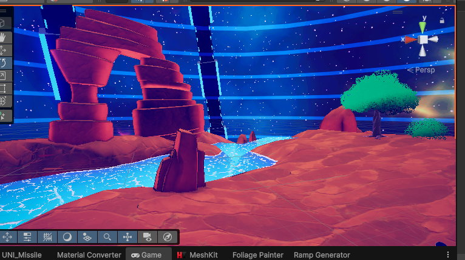

# ShadersLab - Screen Space Outline (URP)

A high-performance, production-ready screen-space outline solution built on the Unity 6 Render Graph architecture. This package provides robust edge detection using Depth, Normals, and Color buffers, along with advanced masking capabilities for selective outlining.



## Overview

Unlike traditional \"Inverted Hull\" mesh outlines, this solution operates entirely in screen space as a post-processing effect. This approach offers significant advantages:

*   **Consistent Line Width:** Thickness remains constant regardless of distance or object scale.
*   **Performance Stability:** Render cost is decoupled from scene geometry complexity (poly-count).
*   **Pipeline Integration:** Fully compatible with Unity's Volume system and Render Graph for optimal memory management.

## Key Features

*   **Render Graph Native:** Utilizes the latest Unity 6 API for efficient resource handling and execution.
*   **Dual Algorithms:**
    *   **Sobel:** 3x3 kernel for smoother, higher-quality edges.
    *   **Roberts Cross:** 2x2 kernel for sharper, performance-critical scenarios.
*   **Advanced Masking:**
    *   **Selection Mask:** Outline only specific objects via LayerMask.
    *   **Occlusion Mask:** Prevent outlines from rendering over specific layers (e.g., UI, Transparent Water).
*   **Fading System:** Distance-based and Height-based fading for seamless LOD and atmospheric integration.
*   **Debug Views:** Visualize intermediate buffers (Depth, Normals, Mask) directly in the Game View.
*   **Extensible API:** C# Events for injecting custom draw calls (e.g., for vertex-animated foliage).

---

## Installation

1.  Copy the `Bill-SSOutline` folder into your project's `Assets` directory.
2.  Locate your active **URP Renderer Data** asset.
3.  Click **Add Renderer Feature** and select **Outline Feature**.
4.  In your **URP Asset**, ensure **Depth Texture** and **Opaque Texture** are enabled.

---

## Usage Guide

The effect is controlled via the Volume framework, allowing for local or global overrides.

1.  Add a **Global Volume** to your scene.
2.  Add Override: `Post-processing` -> `Custom` -> `Outline`.
3.  Enable **Is Active**.

### Configuration

#### General Settings

| Parameter | Description |
| :--- | :--- |
| **Mode** | `FullScreen` (All objects), `SelectionOnly` (Masked objects only), or `Mixed`. |
| **Algorithm** | `Sobel` (Quality) or `RobertsCross` (Performance). |
| **Thickness** | Line width in pixels. |
| **Color** | The tint color of the outline. |

#### Edge Detection Thresholds

Adjust these values to control sensitivity.

| Parameter | Description | Tuning Tip |
| :--- | :--- | :--- |
| **Depth** | Sensitivity to distance changes. | Increase to prevent artifacts on the Skybox. |
| **Normal** | Sensitivity to surface angle changes. | Increase to reduce internal lines on flat, normal-mapped surfaces. |
| **Color** | Sensitivity to albedo contrast. | Requires `Use Color` to be enabled. |

#### Masking

| Parameter | Description |
| :--- | :--- |
| **Selection Layer** | Objects in these layers are rendered into the Selection Mask (for `SelectionOnly` mode). |
| **Occlusion Layer** | Objects in these layers will occlude the outline. Useful for semi-transparent objects or UI. |

---

## Advanced Integration

### Custom Shaders & Foliage

Standard URP shaders work automatically. For custom shaders (e.g., vegetation with vertex displacement), you must add a specific Pass to render into the Selection Mask correctly.

#### Shader Implementation (HLSL)

Add this Pass to your shader:

```hlsl
Pass
{
    Name "SelectionMask"
    Tags { "LightMode" = "SelectionMask" }
    
    ZWrite On
    ColorMask R

    HLSLPROGRAM
    #pragma vertex Vertex
    #pragma fragment Fragment
    
    #include "Packages/com.unity.render-pipelines.universal/ShaderLibrary/Core.hlsl"

    // Include your vertex logic here to match the main pass (e.g. Wind animation)
    
    half4 Fragment(Varyings input) : SV_Target
    {
        return half4(1, 0, 0, 1);
    }
    ENDHLSL
}
```

#### Scripting API

Alternatively, you can manually push render commands to the mask buffer using the static event in C#:

```csharp
void Start() {
    OutlineFeature.OnRenderFoliageMask += DrawCustomGeometry;
}

void DrawCustomGeometry(RasterCommandBuffer cmd, LayerMask mask) {
    // Custom drawing logic utilizing the Render Graph context
}
```

---

## Performance

| Feature | Cost | Memory | Notes |
| :--- | :--- | :--- | :--- |
| **Basic Outline** | Low | 1 Fullscreen RT | Reuses existing Depth/Normal buffers. |
| **Selection Mode** | Medium | +1 R8 Texture | Requires an additional draw pass for selected objects. |
| **Occlusion Mode** | Medium | +1 R8 Texture | Requires an additional draw pass for occluders. |
| **Color Edge** | High | N/A | Requires SceneColor fetch; use sparingly on mobile. |

### Optimization Best Practices

1.  **Selection Layer:** Keep the number of objects in the Selection Layer minimal to reduce draw calls in the mask pass.
2.  **Algorithm:** Use `Roberts Cross` for mobile platforms to reduce texture lookups.
3.  **Color Mode:** Disable `Use Color` unless absolutely necessary for the art style.

---

## Troubleshooting

**Skybox Artifacts:**
If lines appear across the sky, increase the **Depth Threshold**. The skybox is at the far clip plane, creating a large depth delta against foreground objects.

**Flickering Lines:**
Screen-space lines can alias. Enable TAA (Temporal Anti-Aliasing) in the camera settings or increase the line thickness to mitigate sub-pixel artifacts.

**Flat Surface Noise:**
If flat surfaces show unwanted lines, increase the **Normal Threshold**. This is common on objects with detailed normal maps.

---

## License

MIT License

Copyright (c) 2025 BillTheDev
"